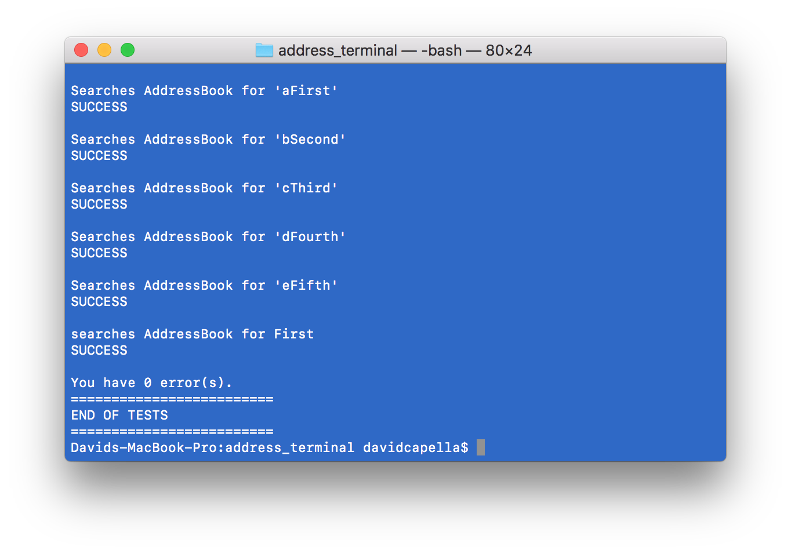

# Address Terminal
A fun project creating a virtual address book coded with Python 3 and using terminal to work.

It is an application that can be used to store names with a phone number and email. You will be able to view, create, search and even import entries from a CSV.

Address Terminal was originally wrote in Ruby and I decided I wanted to see if I could change it over to Python. It was a lot of fun seeing how the different languages reacted.

Users need to be able to affect the entries by d:

* Storing
* Editing
* Deleting
* Viewing
* Searching
* Importing

Address Terminal features are tested in one file.

I decided to make my own tests only because I find it interesting.

```Python
book = AddressBook()

print("Entries = 0")
if len(book.entries) == 0:
    print("SUCCESS")
else:
    print("FAIL")
    errors += 1
```

